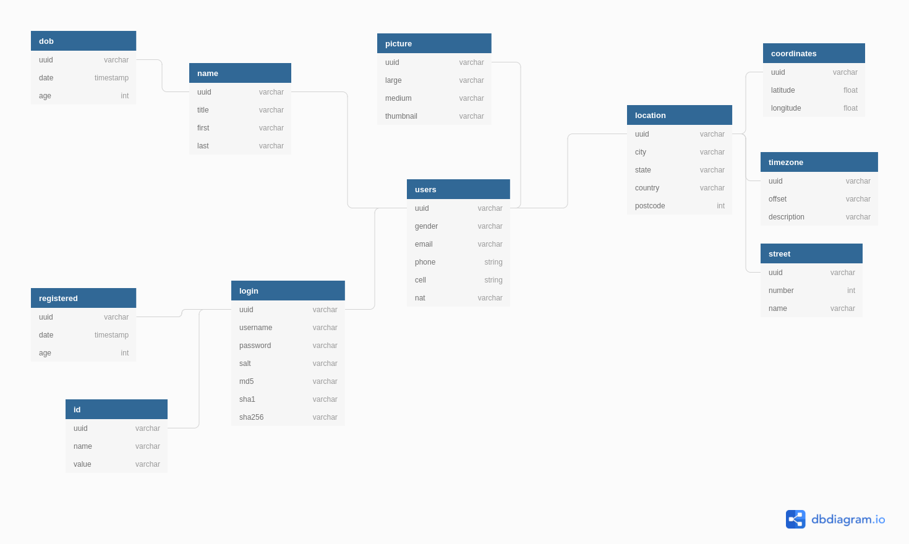
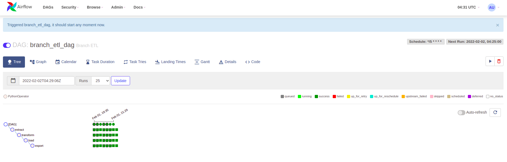
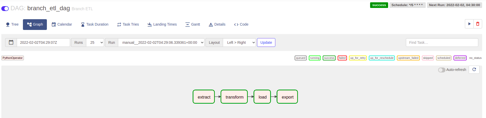
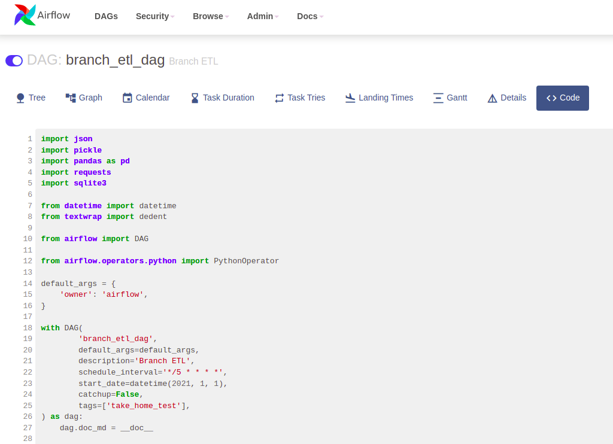

# Branch take home test

## Tasks:

1. Using the json response from the endpoint. Model, and design the database table/tables.
    - You can use [dbdiagram](https://dbdiagram.io/d) to generate the ERD
    - _Deliverable_:
    - Export of ERD 

2. Build an end to end process in Python3, that generates a csv file for each of the tables you have designed
    - The JSON results must be flatten
    - The column names must contain only letters (a-z, A-Z), numbers (0-9), or underscores (_)
    - _Deliverable_:
        - create_data_tables_from_metadata.py:
            - I created this script to quickly set up a sqlLite database to help me run this end to end process
            - This file reads metadata from branch_etl/resources/database_tables.txt and programatically creates the
              tables in the database
        - insert_json_data_into_db.py
            - This script does most of the heavy lifting. It reads the json and splits it into the predefined tables in
              the ERD.
            - After all the tables are defined it programatically inserts them into the database
        - export_to_csv.py reads every table in testing_db and exports them to csv in branch_etl/export
        - Sample table:

|uuid|title|first|last|
|---|---|---|---|
|9e085556-7c76-432e-809d-fdc8c8729834|Mr|Mikkel|Sørensen|

3. Now imagine this is a production ETL process. How would you design it? What tests would you put in place?

- _Deliverable_: I went ahead and set up an Airflow DAG to schedule this ETL pipeline in airflow_dag/branch_etl.py
- I split the code into EXTRACT, TRANSFORM, LOAD and EXPORT
    - Extract
        - In this stage I pull the json data and saved it as a json file to prepare it for the next step in the pipeline
    - Transform
        - In this stage I read the json file and split it into tables. To make it easier to share data between this
          stage and the Load stage I pickled the tables object
        - If this was a truly productionalized process with large amounts of data I wouldn't have used pickle. I would
          have saved the file to disk or created a solution to insert the data to a more robust database while
          transforming it.
    - Load
        - In this stage I read the pickle object, which is a list of tables and created a function to abstract the
          insert statement for each table in the database
        - In production you'd probably use an ORM like sqlAlchemy or Hibernate in Java to serialize the data. For the
          purposes of this exercise an interpolated insert string was fine
    - Export
        - For the last requirement I decided to not reinvent the wheel and use the excellent Pandas library to read each
          table directly from the database and write it to file
        - You might be able to use Pandas in a production environment to export tables to CSV but depending on data size
          and throughput requirements there might be better options like using Spark to distribute the export task
- Branch_ETL running on my local Airflow environment with an every 5 minutes schedule
    - 
    - 
    - 
- Testing
    - If this was a production ETL process I would add tests around data types and double check each column going into
      the database to be sure they match.
    - A lot of these tests/checks could be done through an ORM.
    - Other tests:
        - Compare record counts between source and destinatino
        - Checking that records that needed to be casted to a different type are correct. For example that timestamps
          are truly represented as timestamps
        - Create a summary of the data and store it to analyze KPIs and raise flags if values vary past a defined
          threshold